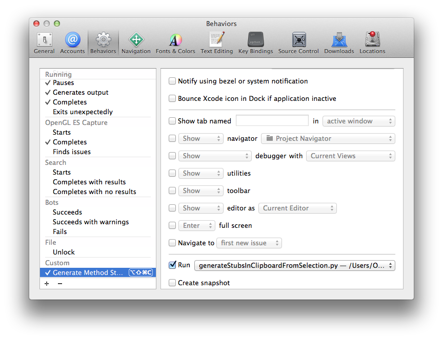

# xcodeScripts
===

## generateStubsInClipboardFromSelection.py

A python script that generate method stubs from selected method declarations in Xcode and put in clipboard on Mac.

#### Usage
  1. Select some method declarations (include the semicolon "**;**") in Xcode.        
  2. Run the script
  
  For example:
  In Xcode, we select following code.
  
  	- (void)doSomething;
  	+ (id)objectWithSomething:(id)inSomething;
  	
  Then we run the script.
  It will put following code in clipboard.
  
  	- (void)doSomething
  	{
  	}
  	
  	+ (id)objectWithSomething:(id)inSomething
  	{
  	}
  
#### How it work?

The python code get the method declarations strings and replace all "**;**" to "{}". So the selection methods must include the semicolon "**;**"

#### Add shortcut in Xcode's "Behaviors"

You can run this script conveniently by adding a behavior in Xcode. And assign this behavior with a keyboard shortcut.
